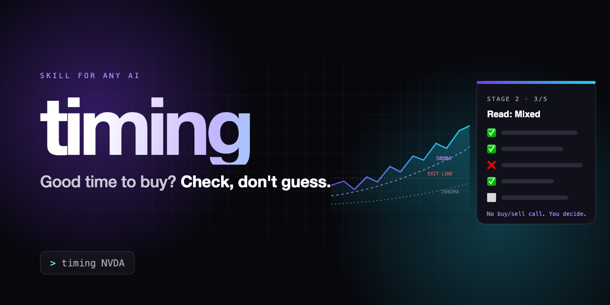

<p align="center"></p>

# Stock Timing Checklist

Ask "is it a good time to buy NVDA?" and get a checklist instead of a guess: which timing rules the
chart meets right now ✅, which it misses ❌, what's unknown ⬜, the price levels that matter, and the
line where you'd admit you were wrong.

It never says "buy" or "sell". It tells you how well the current chart fits a written set of rules,
and what would have to change. You make the call.

## What a read looks like

```
SPY.US · 779.09 USD · market closed
Read: Conditions favour buying, but the new high came on light volume and the exit line is only 2% away.

Stage 2 checklist (R-003) — 5/5
✅ Price above 50DMA — 779.09 vs 763.81
✅ 50DMA above 200DMA — 763.81 vs 718.14
✅ Both averages rising — 50DMA +1.07%, 200DMA +1.34%
✅ Up-days on more volume — ratio 1.05 (thin)
✅ Under 25% below 52-week high — 0.3% below 781.62

Multiple edge (R-011) — 4/6
...
Watch for
⬜ A close below 763.81 (50DMA), the first exit signal
```

Full examples: [`examples/spy.md`](examples/spy.md) · [`examples/btc-ibit.md`](examples/btc-ibit.md) (a "Mixed" read).

## Works with or without live market data

Pick the row that matches your AI tool.

| You have | How it gets the numbers | Start here |
|---|---|---|
| **A. Claude Code + the Longbridge MCP** | Live quotes and candles, every run | [`agent/stock-timing.md`](agent/stock-timing.md) |
| **B. Any AI that can run Python** (Claude Code, Codex, Cursor, ChatGPT with code) | `tools/indicators.py` fetches 2 years of daily prices from Yahoo Finance, or reads a CSV you downloaded. No API key. | [`tools/indicators.py`](tools/indicators.py) |
| **C. A chat AI with no tools** (ChatGPT, Gemini, Perplexity, Claude.ai) | It asks you for a short fill-in list you can read off any free chart site | [`PROMPT.md`](PROMPT.md) |

Every route uses the same rules and the same checklist. If a number can't be found, it shows ⬜ unknown.
It does not make up a number.

## Quick start

**C. Any chat AI (2 minutes)**
1. Copy all of [`PROMPT.md`](PROMPT.md) and paste it as your first message (or into a custom GPT,
   Gem, Project or Space).
2. Ask: "Is it a good time to buy NVDA?" and answer its fill-in list.

**B. Run the script yourself, then paste the output into any AI**
```bash
python3 tools/indicators.py --yahoo NVDA       # or 0700.HK, BTC-USD, SPY
python3 tools/indicators.py my_prices.csv      # any CSV with Date, High, Low, Close, Volume
```
Python 3.8+, standard library only. The Yahoo route uses a public but unofficial endpoint, so if it
breaks, download a CSV from Yahoo Finance's "Historical Data" page or your broker and pass that.

**Claude Code (skill, routes B and C)**
```bash
git clone https://github.com/klmiing1229-a11y/Investing_Agent ~/.claude/skills/stock_timing_checklist
```
Then start a message with `timing`, e.g. `timing NVDA`.

**A. Claude Code with live data (agent)**
1. Clone as above, connect the Longbridge MCP, and copy the agent in:
   `cp ~/.claude/skills/stock_timing_checklist/agent/stock-timing.md ~/.claude/agents/`
2. If your Longbridge server isn't the claude.ai connector, change the `mcp__claude_ai_Longbridge__`
   prefix in the agent's `tools:` line to your server's name.
3. Ask "Is it a good time to buy 700.HK?"

The agent can only use 24 **read-only** Longbridge tools. Every order, account, position, alert
and watchlist tool is left out on purpose, so it cannot trade or see your account.

## Teach it your own rules

The 12 starter rules in [`KB.md`](KB.md) are common stage-analysis practice: the four-stage model,
moving averages, and needing three or more signals to agree before you enter. When you learn
something from a course, book or talk, write:

```
learn: <your notes>
```

It turns the notes into numbered rules (R-013, R-014, …), flags any that contradict existing
rules, and from then on its reads cite them. Chat AIs hand you the lines to paste into `KB.md`;
Claude Code writes them in itself.

## Optional: your position

Copy [`PORTFOLIO.example.md`](PORTFOLIO.example.md) to `PORTFOLIO.md` with a rough picture of your
pot. The read then adds one line saying how big one share is next to your pot, and whether the
new position would overlap what you already hold. Don't put account numbers or logins in it.

## Files
```
PROMPT.md               the whole method, for any AI
SKILL.md                Claude Code skill wrapper (trigger: "timing")
KB.md                   the rules, R-001…, grows with LEARN mode
agent/stock-timing.md   Claude Code subagent for live Longbridge data
tools/indicators.py     MAs, slopes, RSI, MACD, volume, levels, Stage 2 checklist
PORTFOLIO.example.md    optional template for the "Your position" line
examples/               two real reads
```

## Limits
- **Not financial advice.** It is a structured way to check your own rules, for education.
- Chart rules describe the past. A checklist that looks fine can still fail on news.
- The starter rules come from stock charts. Using them on crypto or thin markets is an extrapolation, and the read says so.
- It doesn't pick what to buy, size positions, handle tax or place trades.

MIT licence.
